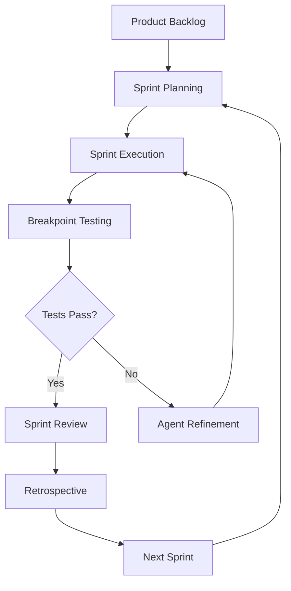
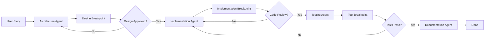
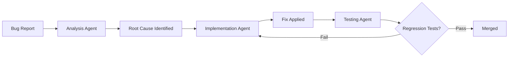
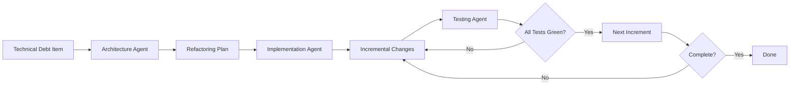

# BMAD-METHOD Integration Analysis
## Circuit-Explainer Project Enhancement Plan

---

## Executive Summary

The **BMAD-METHOD** (Breakpoint-Driven Multi-Agent Development) framework provides a structured approach to AI-assisted software development using agile methodology. This document analyzes how integrating BMAD into the circuit-explainer project can systematically guide AI agents through iterative development, testing, and refinement.

---

## Understanding BMAD-METHOD

### Core Philosophy

BMAD-METHOD is based on the principle that complex software development should be broken down into discrete, manageable "breakpoints" where:
- Each breakpoint represents a testable milestone
- AI agents work systematically through user stories
- Agile practices (sprints, retrospectives, testing) are codified into the workflow
- Multiple agents can collaborate on different aspects

### Key Components



### BMAD Workflow Stages

1. **Backlog Management**: User stories and requirements
2. **Sprint Planning**: Breaking down work into breakpoints
3. **Agent Orchestration**: Multiple AI agents handling different concerns
4. **Breakpoint Validation**: Testing at each milestone
5. **Continuous Integration**: Automated validation
6. **Retrospective Analysis**: Learning and improvement

---

## Benefits for Circuit-Explainer Project

### 1. Systematic Feature Development

**Current State**: Single monolithic Streamlit app (1892 lines)

**BMAD Benefit**: Break down into modular components with clear boundaries

```
User Story: "As a learner, I want to explore different circuit types beyond induction heads"

Breakpoints:
├── BP-1: Create circuit abstraction interface
├── BP-2: Implement IOI circuit visualization
├── BP-3: Add greater-than circuit example
├── BP-4: Create circuit comparison view
└── BP-5: Integration testing across all circuits
```

### 2. Multi-Agent Collaboration

Different agents can handle specialized concerns:

| Agent Type | Responsibility | Example Task |
|------------|----------------|--------------|
| **Architecture Agent** | Design patterns, structure | Refactor visualization system for extensibility |
| **Implementation Agent** | Write code following specs | Implement new circuit types |
| **Testing Agent** | Validation, edge cases | Create test suites for attention patterns |
| **Documentation Agent** | Keep docs synchronized | Update README with new features |
| **UX Agent** | Accessibility, usability | Ensure AuDHD-friendly design maintained |

### 3. Quality Gates at Breakpoints

Each breakpoint includes validation criteria:

```python
# Example breakpoint definition
breakpoint_001 = {
    "id": "BP-001",
    "story": "Extract attention visualization into reusable component",
    "acceptance_criteria": [
        "Function accepts arbitrary attention matrix",
        "Supports custom colorscales",
        "Maintains hover text functionality",
        "Works with different token counts (2-50)",
        "Preserves accessibility features"
    ],
    "tests": [
        "test_attention_heatmap_renders",
        "test_custom_colorscale_applied",
        "test_hover_text_accuracy",
        "test_token_count_scalability"
    ]
}
```

### 4. Agile Sprint Structure

Transform development into manageable sprints:

**Sprint 1: Modularization & Architecture**
- BP-1: Extract visualization components
- BP-2: Create circuit base class
- BP-3: Refactor current induction head to use new architecture

**Sprint 2: Additional Circuits**
- BP-4: Implement IOI circuit
- BP-5: Implement copying head circuit
- BP-6: Create circuit selection UI

**Sprint 3: Interactive Analysis**
- BP-7: Add model upload capability
- BP-8: Implement automatic circuit detection
- BP-9: Create circuit comparison tools

### 5. Continuous Learning & Improvement

BMAD's retrospective phase captures:
- What worked well in each sprint
- Patterns that should be replicated
- Issues that need addressing
- Architectural decisions and rationale

---

## Integration Architecture

### Project Structure with BMAD

```
circuit-explainer/
├── src/
│   ├── circuits/              # Circuit implementations
│   │   ├── base.py           # Abstract circuit class
│   │   ├── induction.py      # Induction head circuit
│   │   ├── ioi.py            # Indirect Object Identification
│   │   └── copying.py        # Copying head circuit
│   ├── visualization/         # Reusable viz components
│   │   ├── attention.py      # Attention heatmaps
│   │   ├── flow.py           # Information flow diagrams
│   │   └── eigenvalue.py     # Matrix analysis plots
│   ├── ui/                    # Streamlit UI components
│   │   ├── sidebar.py        # Technical reference sidebar
│   │   ├── tabs.py           # Main tab navigation
│   │   └── playground.py     # Interactive playground
│   └── utils/                 # Shared utilities
│       ├── token_utils.py    # Token processing
│       └── pattern_utils.py  # Pattern detection
├── tests/                     # Test suite
│   ├── test_circuits.py
│   ├── test_visualization.py
│   └── test_ui.py
├── bmad/                      # BMAD configuration
│   ├── backlog/              # User stories
│   │   ├── sprint_01.md
│   │   ├── sprint_02.md
│   │   └── sprint_03.md
│   ├── breakpoints/          # Breakpoint definitions
│   │   ├── bp_001_extract_viz.py
│   │   ├── bp_002_circuit_base.py
│   │   └── ...
│   ├── agents/               # Agent configurations
│   │   ├── architecture_agent.yaml
│   │   ├── implementation_agent.yaml
│   │   └── testing_agent.yaml
│   └── workflows/            # BMAD workflow definitions
│       ├── sprint_workflow.yaml
│       └── release_workflow.yaml
├── docs/                      # Documentation
│   ├── architecture.md
│   ├── circuits_guide.md
│   └── development_guide.md
├── induction_heads_explorer.py  # Main app (to be refactored)
├── pyproject.toml
└── README.md
```

### Workflow Example: Adding a New Circuit

```yaml
# bmad/workflows/add_circuit_workflow.yaml
name: Add New Circuit Type
trigger: user_story
agents:
  - architecture_agent
  - implementation_agent
  - testing_agent
  - documentation_agent

stages:
  - name: design
    agent: architecture_agent
    breakpoints:
      - id: design_circuit_interface
        validation:
          - interface_follows_base_class
          - visualization_requirements_defined
          - interaction_patterns_specified
    
  - name: implement
    agent: implementation_agent
    depends_on: design
    breakpoints:
      - id: create_circuit_class
        validation:
          - all_abstract_methods_implemented
          - type_hints_complete
          - docstrings_present
      
      - id: implement_visualizations
        validation:
          - renders_correctly
          - maintains_accessibility
          - interactive_elements_work
    
  - name: test
    agent: testing_agent
    depends_on: implement
    breakpoints:
      - id: unit_tests
        validation:
          - coverage_above_80_percent
          - edge_cases_handled
      
      - id: integration_tests
        validation:
          - integrates_with_ui
          - works_with_existing_circuits
    
  - name: document
    agent: documentation_agent
    depends_on: test
    breakpoints:
      - id: update_docs
        validation:
          - api_docs_generated
          - user_guide_updated
          - examples_added
```

---

## Implementation Roadmap

### Phase 1: Foundation (Sprint 0)

**Goal**: Set up BMAD infrastructure

#### Breakpoints:
1. **BP-000**: Initialize BMAD directory structure
2. **BP-001**: Create backlog from current project analysis
3. **BP-002**: Define agent roles and responsibilities
4. **BP-003**: Set up testing framework (pytest)
5. **BP-004**: Configure CI/CD pipeline

**Deliverables**:
- BMAD directory structure in place
- Initial backlog with 15-20 user stories
- Agent configuration files
- Basic test infrastructure

### Phase 2: Refactoring (Sprint 1)

**Goal**: Extract and modularize existing code

#### Breakpoints:
1. **BP-100**: Extract visualization functions
   - [`create_attention_heatmap()`](induction_heads_explorer.py:381) → `visualization/attention.py`
   - [`create_information_flow_diagram()`](induction_heads_explorer.py:592) → `visualization/flow.py`
   - [`create_path_expansion_diagram()`](induction_heads_explorer.py:815) → `visualization/path.py`

2. **BP-101**: Extract UI components
   - [`render_sidebar()`](induction_heads_explorer.py:145) → `ui/sidebar.py`
   - Tab renderers → `ui/tabs/`

3. **BP-102**: Create circuit abstraction
   - Define `Circuit` base class
   - Migrate induction head to new structure

4. **BP-103**: Add comprehensive tests
   - Test all extracted components
   - Ensure no regression

**Validation Criteria**:
- All tests pass
- No functionality lost
- Code coverage > 75%
- Streamlit app still runs correctly

### Phase 3: Extension (Sprint 2-3)

**Goal**: Add new circuit types and features

#### New Circuits:
1. **IOI Circuit** (Indirect Object Identification)
2. **Copying Heads** (Simple token copying)
3. **Greater-Than Circuit** (Numerical comparison)

#### New Features:
1. Circuit comparison view
2. Model upload and analysis
3. Automatic circuit detection

### Phase 4: Advanced Features (Sprint 4+)

1. **TransformerLens Integration**
   - Load actual model weights
   - Analyze real attention patterns
   - Detect circuits automatically

2. **Research Tools**
   - Hypothesis testing framework
   - Circuit composition analysis
   - Activation patching visualization

3. **Educational Enhancements**
   - Guided tutorials
   - Progress tracking
   - Interactive quizzes

---

## BMAD Agent Workflow Patterns

### Pattern 1: Feature Development



### Pattern 2: Bug Fix



### Pattern 3: Refactoring



---

## Specific Benefits for Your Use Case

### 1. Maintain Code Quality During Expansion

As you add more circuit types, BMAD ensures:
- Consistent patterns across implementations
- Comprehensive test coverage
- Clear separation of concerns
- Documentation stays current

### 2. AuDHD-Friendly Development Process

BMAD's structured approach aligns with neurodivergent-friendly practices:
- **Clear boundaries**: Each breakpoint has specific scope
- **Predictable workflow**: Same process every time
- **Explicit validation**: No ambiguity about "done"
- **Incremental progress**: Small, manageable steps
- **Written documentation**: Everything captured explicitly

### 3. Knowledge Preservation

BMAD captures:
- **Design decisions**: Why choices were made
- **Patterns**: What works well for this codebase
- **Gotchas**: Edge cases and tricky bits
- **Evolution**: How the system grew over time

### 4. Collaborative Development

If working with others (human or AI):
- **Clear handoffs**: Breakpoints define completion
- **Parallel work**: Different agents/developers on different breakpoints
- **Conflict avoidance**: Clear ownership and interfaces
- **Review process**: Built into workflow

---

## Example User Stories for Backlog

### Epic: Multi-Circuit Support

**Story 1**: As a learner, I want to explore IOI circuits so I can understand how transformers handle indirect object identification.

**Acceptance Criteria**:
- IOI circuit implementation following base circuit pattern
- Step-by-step explanation similar to induction heads
- Interactive playground for IOI examples
- Comparison view between induction and IOI

**Story 2**: As an educator, I want to show multiple circuits side-by-side so students can compare their mechanisms.

**Acceptance Criteria**:
- Multi-circuit view supporting 2-4 circuits
- Synchronized interaction (selecting a step updates all)
- Clear visual distinction between circuit types
- Comparison summary highlighting differences

### Epic: Model Analysis

**Story 3**: As a researcher, I want to upload my own model weights so I can analyze its learned circuits.

**Acceptance Criteria**:
- Support for HuggingFace model loading
- Support for TransformerLens format
- Automatic attention pattern extraction
- Circuit detection heuristics

**Story 4**: As a learner, I want to see circuit detection scores so I can understand how to identify circuits in practice.

**Acceptance Criteria**:
- Display induction head scores
- Show composition strength metrics
- Visualize eigenvalue distributions
- Explain interpretation of scores

---

## Risk Analysis & Mitigation

### Risk 1: Over-Engineering

**Concern**: BMAD adds complexity for a relatively simple Streamlit app

**Mitigation**:
- Start with minimal BMAD structure (backlog + basic breakpoints)
- Add agent orchestration only when managing multiple parallel efforts
- Keep workflow definitions simple and human-readable
- Don't create breakpoints smaller than 30-60 minutes of work

### Risk 2: Testing Overhead

**Concern**: Comprehensive testing may slow development

**Mitigation**:
- Focus testing on reusable components (visualization, circuits)
- UI tests can be lighter (smoke tests mainly)
- Use snapshot testing for visualizations
- Automated tests in CI, not blocking local development

### Risk 3: Documentation Burden

**Concern**: Keeping docs updated with rapid development

**Mitigation**:
- Make documentation agent part of every workflow
- Docs are an acceptance criterion (breakpoint doesn't pass without them)
- Use docstrings as primary documentation (auto-generate API docs)
- Keep high-level docs in markdown, updated per sprint

---

## Recommended Next Steps

### Immediate Actions (Week 1)

1. **Set up BMAD structure**
   - Create `bmad/` directory
   - Define initial backlog
   - Configure agent roles

2. **Create Sprint 1 plan**
   - Focus: Refactoring existing code
   - 5-7 breakpoints
   - 1-2 week duration

3. **Set up testing infrastructure**
   - Install pytest
   - Create first test file
   - Configure CI (GitHub Actions)

### Short-term (Weeks 2-4)

1. **Execute Sprint 1**
   - Extract visualization components
   - Create circuit abstraction
   - Add tests for extracted code

2. **Sprint 1 Retrospective**
   - Document what worked
   - Refine breakpoint sizing
   - Adjust agent responsibilities

3. **Plan Sprint 2**
   - Based on Sprint 1 learnings
   - Focus on first new circuit (IOI)

### Medium-term (Months 2-3)

1. **Add 2-3 more circuit types**
2. **Implement model upload feature**
3. **Create circuit comparison tools**
4. **Build automatic detection system**

### Long-term Vision (6+ months)

1. **Full research toolkit**
2. **Community contributions**
3. **Published educational resource**
4. **Integration with mechanistic interpretability tools**

---

## Conclusion

Integrating BMAD-METHOD into the circuit-explainer project provides:

✅ **Structure**: Systematic development process  
✅ **Quality**: Built-in testing and validation  
✅ **Scalability**: Clear patterns for expansion  
✅ **Collaboration**: Framework for multi-agent work  
✅ **Documentation**: Knowledge captured automatically  
✅ **Agility**: Iterative improvement with retrospectives  

The framework transforms ad-hoc development into a repeatable, reliable process that maintains quality while enabling rapid feature expansion. For a project aimed at education and exploration, this systematic approach ensures the codebase remains maintainable and extensible as it grows.

---

## Questions for Discussion

1. **Scope**: Should we start with full BMAD or a lightweight version?
2. **Timeline**: What's your target for the first refactored sprint?
3. **Priorities**: Which new circuits are most important to add first?
4. **Automation**: How much CI/CD automation do you want initially?
5. **Collaboration**: Will this be solo development or collaborative?

---

*This analysis provides a foundation for discussion. The actual implementation plan should be refined based on your specific goals, timeline, and constraints.*